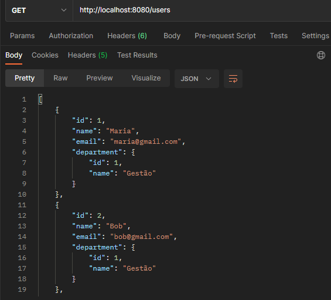
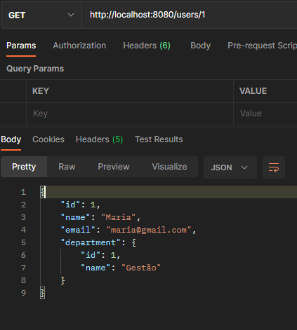
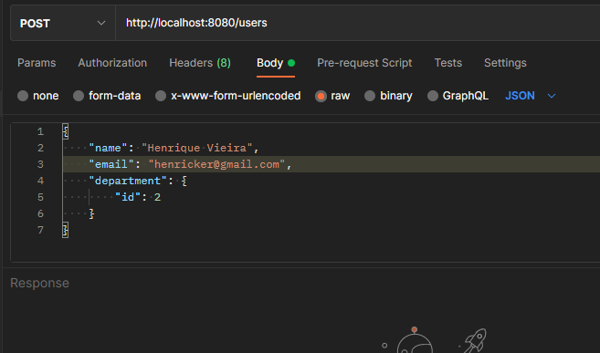
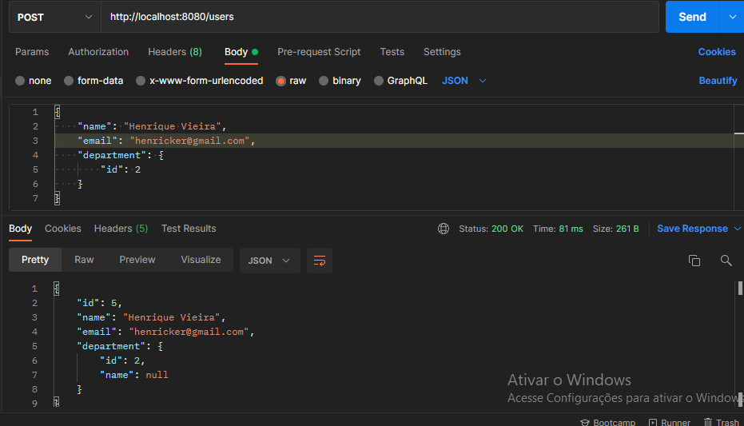

Aqui nós temos uma simples API REST que responde à requisições
de Usuários e departamentos

Tecnologias Usadas:
* Spring Boot
* ORM: Spring Data JPA
* H2 -> como banco em memória

<h2>Listando os usuários</h2>

<h2>Mostrando por id</h2>

<h2>Enviando um novo usuário na requisição</h2>

